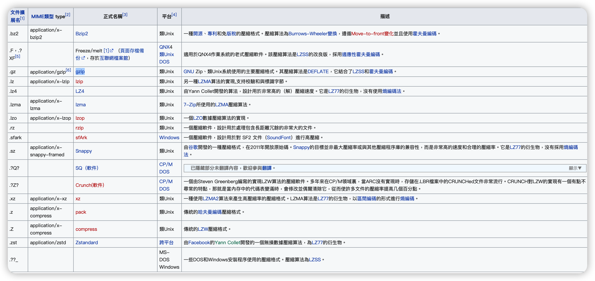

# RPC 支持壓縮算法

## 需求分析

### 場景分析

- 開發者希望在某個方法上使用壓縮算法
  - 如在獲取文章摘要的時候並不需要啓用壓縮算法，但是在獲取文章詳細內容的時候啓用壓縮算法
- 開發者希望在某個服務上啓用壓縮算法
- 開發者希望請求或者響應能夠單獨控制是否使用壓縮算法，以及使用不同的壓縮算法：
  - 請求過去不使用壓縮算法，但是響應過來使用了壓縮算法；反過來也可以
  - 請求過去使用了 A 算法，但是響應過來使用了 B 算法
- 開發者希望能夠自動檢測傳輸數據大小，在傳輸數據超過一個閾值的時候啓用壓縮算法
- 開發者希望能夠實時檢測網路負載，在網路負載很高的時候啓用壓縮算法。跟進一步地，開發者希望在負載低的時候啓用低壓縮率的算法，在負載高的時候啓用高壓縮率的算法
- 開發者希望能夠實時檢測 CPU 使用率，在 CPU 使用率很高的時候棄用壓縮算法

只提供基本的壓縮算法，不提供動態檢測壓縮算法。

### 功能需求

- 支持不同的壓縮算法
- 允許用戶接入自定義算法

- 用戶可以在服務層面上控制壓縮算法，但是不需要在方法級別上控制壓縮與否，以及使用何種算法

- 響應將採用和請求一樣的壓縮算法。即如果請求採用了壓縮，那麼響應會啓用壓縮算法，並且使用同樣的壓縮算法

### 非功能需求

- 良好的擴展性，即用戶可以使用不同的壓縮算法
- 在將來我們可能會在方法級別，以及請求和響應分別控制壓縮與否與壓縮算法，所以在設計和實現的時候要注意別太死板


## 行業方案

### HTTP 壓縮協議

HTTP壓縮（https://developer.mozilla.org/zh-CN/docs/Web/HTTP/Compression）是一種內建到網頁伺服器和網頁客戶端中以改進傳輸速度和頻寬利用率的方式。

 HTTP資料在從伺服器傳送前就已壓縮：相容的瀏覽器將在下載所需的格式前宣告支援何種方法給伺服器；不支援壓縮方法的瀏覽器將下載未經壓縮的資料。


相對友好的方式為，HTTP 請求頭 Accept-Encoding 會將客戶端能夠理解的內容編碼方式進行通知（給服務端），通過內容協商的方式，使用並在響應頭 Content-Encoding 中通知客戶端該選擇。

- Content-Encoding： 服務端告訴客戶端用什麼壓縮算法
- Accept-Encoding：客戶端聲明支持什麼壓縮算法

HTTP 支持算法：

- gzip（LZ77）
- compress（LZW）
- deflate（zlib、deflate）
- br（Brotil）

### gRPC

gRPC 設計（https://grpc.github.io/grpc/core/md_doc_compression.html）

提供了壓縮算法使用文件（https://github.com/grpc/grpc-go/blob/master/Documentation/compression.md）和例子（https://github.com/grpc/grpc-go/tree/master/examples/features/compression）

其中提到兩點，甚至可以採用不對稱壓縮算法溝通：

- 客戶端在 Header 可以透過 Message-Accept-Encoding 指壓縮算法
- 還可以在 header 指定 Compressed-Flag bit 

這兩個作用重疊，因為指定算法代表有使用壓縮，Compressed-Flag bit 自然也是被設定的；若無， Compressed-Flag bit 也是沒被設定的。

### 壓縮算法比較

不同的壓縮算法也會導致傳輸效率不同，需要從壓縮率和速度（壓縮大，cpu開銷大，速度慢）間做出取捨，取得一個適當的平衡。

https://zh.wikipedia.org/zh-hk/压缩文件格式列表



目前最廣泛使用的為 gzip，各方面較平均。

Go 支援壓縮格式為（https://pkg.go.dev/compress）：

- bzip2
- flate
- gzip
- lzw
- zlib

## 設計

支持壓縮算法，類似序列化算法，基本上雙方都需要處理：

- 客戶端指定壓縮算法
- 服務端也需要支持指定的壓縮算法

我們需要一個壓縮處理的接口，支持壓縮和解壓縮的方法。

```go
type Compressor interface {
  Code() int8
  Compress(data []byte) ([]byte, error)
  Decompress(data []byte) ([]byte, error)
}
```


### DefaultCompressor

預設建構子概念，實現壓縮處理接口方法，在沒有提供特定壓縮算法時使用。

```go
type DefaultCompressor struct {
}

func (d DefaultCompressor) Code() uint8 {
	return 0
}

func (d DefaultCompressor) Compress(data []byte) ([]byte, error) {
	return data, nil
}

func (d DefaultCompressor) Decompress(data []byte) ([]byte, error) {
	return data, nil
}
```


### GZIP 壓縮實現

封裝官方 GZIP SDK，為 gzip 提供一個實現，作為二次開發使用。

```go
type GzipCompressor struct {
}

func (g GzipCompressor) Code() uint8 {
	return 1
}

func (g GzipCompressor) Compress(data []byte) ([]byte, error) {
	return data, nil
}

func (g GzipCompressor) Decompress(data []byte) ([]byte, error) {
	return data, nil
}
```


### 服務端處理

需要在啟動時候，註冊服務端自己支持的壓縮算法。

```go
func(s *Server) RegisterCompressor(c Compressor) {
  panic("implement me")
}
```

在特定使用算法時候，需要使用預設壓縮算法，

再服務端收到客戶端回傳後，要先解壓縮處理，和反序列化。

```go
func (s *reflectionStub) invoke(ctx context.Context, req *message.Request) ([]byte, error) { // or (Response, error)
	// 拿取 Request
 	// 解壓縮
  // 反序列化
  // 處理 & 回傳 Response
}
```


### 客戶端處理 

啟用序列化協議，指定是否使用壓縮算法。採用 Option 模式加入指定的壓縮算法實現。

```go
type ClientOption func(client *Client)
func ClientWithCompressor(c compressor.Compressor) ClientOption {
	return func(client *Client) {
		client.compressor = c
	}
}
```

此處只會壓縮 Body，不會壓縮 Header。跟服務端邏輯一樣，先序列化後，再進行壓縮。這部分需要修改原有的注入邏輯：

```go
fn := func(args []reflect.Value) (results []reflect.Value) {
	// 序列化
  // 壓縮
  // 發送 Request
}

```


## 測試

### 單元測試

因為本身壓縮算法都是依賴於 Go SDK，我們只是提供簡單的封裝，所以只需要進行簡單的測試。

### 集成測試

- 在未指定壓縮算法時，能正常運作
- 在客戶端執行壓縮算法，但服務端未指定時，需要報錯給客戶端
- 客戶端和服務端都指定壓縮算法，正常運行

### 模糊測試

實際上，如果我們自己實現一個壓縮算法，那麼可以考慮使用模糊測試。即對模糊測試生成的數據進行壓縮，再解壓縮，應該能夠還原為原始數據。

不過在我們的 gzip，是 Go SDK 實現的，所以我們可以不必設計模糊測試。
