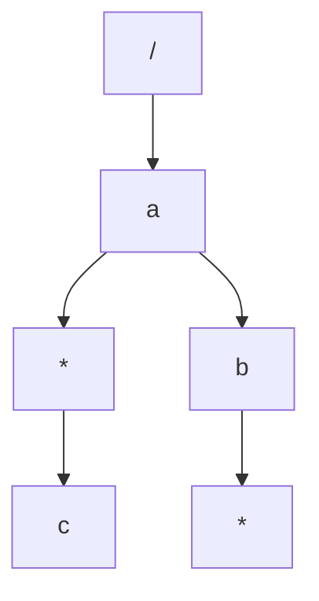

# 可路由的 middleware 设计

## 目標

- 允許用戶在特定路由註冊 middleware
- middleware結果為所有 route 匹配到的middleware的集合
- 越具體路由越後調度
  - 調度順序： ms3、ms2、ms1

```go
Use("GET", "/a/b", ms1)
Use("GET", "/a/*", ms2)
Use("GET", "/a", ms3)
```

## 思路

- 依照大明老師文檔思路去考慮，就是在找到葉子節點後，再層序遍歷匯集路由經過的每個節點的middleware
- 所以就是遍歷樹，可以採用`resursive`、`BFS`、`DFS`
- 這邊採用`BFS`進行測試
- 不過單元測試需要花更多心力思考（測試用例，直接採用大明老師的...），依目前設計有些地方很奇怪
  - 優先級： 越具體路由，越後面調度
  - e.g. `/a/*/c`, `/a/b/*`
  - 這樣是否為每個都遍歷，或是只到第二層即可？



```go
// 遍歷匹配route的所有middlewares
// 把 tree 整個掃過一遍，找出符合情況的middleware
// 使用 recursive 或是 BFS、DFS
queue := []*node{root}
//mdlList := []Middleware{}
mdlList := make([]Middleware, 0, 16)
for i, _ := range segs {
    seg := segs[i]
    var children []*node
    for _, currNode := range queue {
        children = append(children, currNode.childrenOf(seg)...)
        if len(currNode.middlewares) > 0 {
            mdlList = append(mdlList, currNode.middlewares...)
        }
    }
    // 下層遍歷
    queue = children
}
// leaf遍歷
for _, currNode := range queue {
    if len(currNode.middlewares) > 0 {
        mdlList = append(mdlList, currNode.middlewares...)
    }
}
return mdlList
```

## Benchmark

- 因為只有採用`靜態路由`和`通配路由`搭配middleware, 故`findRoute`的測試用例也只採用相關例子
- 從分析結果來看，路由middleware的性能 差2倍，內存操作也是 差2倍
```shell
goos: darwin
goarch: arm64
pkg: geektime-go/web/hw2
Benchmark_findRoute1-10                  1861298               635.7 ns/op           624 B/op         15 allocs/op
Benchmark_findRoute1_Middleware-10        899546              1288 ns/op            1440 B/op         32 allocs/op
PASS
ok      geektime-go/web/hw2     3.549s

```

- cpu.pprof

```shell
Type: cpu
Showing nodes accounting for 2350ms, 79.12% of 2970ms total
Dropped 43 nodes (cum <= 14.85ms)
Showing top 10 nodes out of 97
      flat  flat%   sum%        cum   cum%
    1360ms 45.79% 45.79%     1360ms 45.79%  runtime.kevent
     240ms  8.08% 53.87%      510ms 17.17%  runtime.mallocgc
     210ms  7.07% 60.94%      210ms  7.07%  runtime.madvise
     110ms  3.70% 64.65%      110ms  3.70%  runtime.pthread_kill
     100ms  3.37% 68.01%      130ms  4.38%  runtime.heapBitsSetType
      90ms  3.03% 71.04%      110ms  3.70%  runtime.mapaccess2_faststr
      70ms  2.36% 73.40%       70ms  2.36%  indexbytebody
      70ms  2.36% 75.76%       70ms  2.36%  runtime.pthread_cond_wait
      50ms  1.68% 77.44%       80ms  2.69%  strings.Count
      50ms  1.68% 79.12%      460ms 15.49%  strings.genSplit
```

- mem.pprof

```shell
Type: alloc_space
Showing nodes accounting for 2894.67MB, 99.86% of 2898.83MB total
Dropped 29 nodes (cum <= 14.49MB)
      flat  flat%   sum%        cum   cum%
 1013.05MB 34.95% 34.95%  1661.07MB 57.30%  geektime-go/web/hw2.(*Router).findRoute
  817.53MB 28.20% 63.15%   817.53MB 28.20%  strings.genSplit
  780.08MB 26.91% 90.06%   780.08MB 26.91%  geektime-go/web/hw2.(*Router).findMiddleware
  284.01MB  9.80% 99.86%  1233.60MB 42.56%  geektime-go/web/hw2.(*Router).findRouteWithMiddleware
         0     0% 99.86%  1661.07MB 57.30%  geektime-go/web/hw2.Benchmark_findRoute1
         0     0% 99.86%  1233.60MB 42.56%  geektime-go/web/hw2.Benchmark_findRoute1_Middleware
         0     0% 99.86%   817.53MB 28.20%  strings.Split (inline)
         0     0% 99.86%  2894.67MB 99.86%  testing.(*B).launch
         0     0% 99.86%  2894.67MB 99.86%  testing.(*B).runN

```
