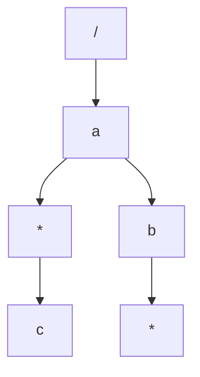

# 可路由的 middleware 设计

## 目標

- 允許用戶在特定路由註冊 middleware
- middleware結果為所有 route 匹配到的middleware的集合
- 越具體路由越後調度
  - 調度順序： ms3、ms2、ms1

```go
Use("GET", "/a/b", ms1)
Use("GET", "/a/*", ms2)
Use("GET", "/a", ms3)
```

## 思路

- 依照大明老師文檔思路去考慮，就是在找到葉子節點後，再層序遍歷匯集路由經過的每個節點的middleware
- 所以就是遍歷樹，可以採用`resursive`、`BFS`、`DFS`
- 這邊採用`BFS`進行測試
- 不過單元測試需要花更多心力思考（測試用例，直接採用大明老師的...），依目前設計有些地方很奇怪
  - 優先級： 越具體路由，越後面調度
  - e.g. `/a/*/c`, `/a/b/*`
  - 這樣是否為每個都遍歷，或是只到第二層即可？



```go
// 遍歷匹配route的所有middlewares
// 把 tree 整個掃過一遍，找出符合情況的middleware
// 使用 recursive 或是 BFS、DFS
queue := []*node{root}
//mdlList := []Middleware{}
mdlList := make([]Middleware, 0, 16)
for i, _ := range segs {
    seg := segs[i]
    var children []*node
    for _, currNode := range queue {
        children = append(children, currNode.childrenOf(seg)...)
        if len(currNode.middlewares) > 0 {
            mdlList = append(mdlList, currNode.middlewares...)
        }
    }
    // 下層遍歷
    queue = children
}
// leaf遍歷
for _, currNode := range queue {
    if len(currNode.middlewares) > 0 {
        mdlList = append(mdlList, currNode.middlewares...)
    }
}
return mdlList
```

## Benchmark

- 因為只有採用`靜態路由`和`通配路由`搭配middleware, 故`findRoute`的測試用例也只採用相關例子
- 從分析結果來看，路由middleware的性能 差2倍，內存操作也是 差2倍
```shell
goos: darwin
goarch: arm64
pkg: geektime-go/web/hw2
Benchmark_findRoute1-10                  1841590               644.1 ns/op           624 B/op         15 allocs/op
Benchmark_findRoute1_Middleware-10        893848              1267 ns/op            1440 B/op         32 allocs/op
PASS
ok      geektime-go/web/hw2     3.583s

```

- cpu.pprof

```shell
Type: cpu
Showing nodes accounting for 2340ms, 76.97% of 3040ms total
Dropped 29 nodes (cum <= 15.20ms)
Showing top 10 nodes out of 98
      flat  flat%   sum%        cum   cum%
    1140ms 37.50% 37.50%     1140ms 37.50%  runtime.kevent
     240ms  7.89% 45.39%      610ms 20.07%  runtime.mallocgc
     200ms  6.58% 51.97%      200ms  6.58%  runtime.madvise
     180ms  5.92% 57.89%      200ms  6.58%  runtime.heapBitsSetType
     140ms  4.61% 62.50%      140ms  4.61%  runtime.pthread_cond_wait
     110ms  3.62% 66.12%      110ms  3.62%  runtime.pthread_kill
     100ms  3.29% 69.41%      100ms  3.29%  runtime.usleep
      80ms  2.63% 72.04%      790ms 25.99%  geektime-go/web/hw2.(*Router).findRoute
      80ms  2.63% 74.67%       80ms  2.63%  runtime.pthread_cond_signal
      70ms  2.30% 76.97%       70ms  2.30%  runtime.nextFreeFast (inline)

```

- mem.pprof

```shell
Type: alloc_space
Showing nodes accounting for 2978.17MB, 99.82% of 2983.47MB total
Dropped 34 nodes (cum <= 14.92MB)
      flat  flat%   sum%        cum   cum%
 1083.55MB 36.32% 36.32%  1746.57MB 58.54%  geektime-go/web/hw2.(*Router).findRoute
  832.53MB 27.90% 64.22%   832.53MB 27.90%  strings.genSplit
  770.58MB 25.83% 90.05%   770.58MB 25.83%  geektime-go/web/hw2.(*Router).findMiddleware
  291.51MB  9.77% 99.82%  1231.60MB 41.28%  geektime-go/web/hw2.(*Router).findRouteWithMiddleware
         0     0% 99.82%  1747.07MB 58.56%  geektime-go/web/hw2.Benchmark_findRoute1
         0     0% 99.82%  1231.60MB 41.28%  geektime-go/web/hw2.Benchmark_findRoute1_Middleware
         0     0% 99.82%   832.53MB 27.90%  strings.Split (inline)
         0     0% 99.82%  2978.67MB 99.84%  testing.(*B).launch
         0     0% 99.82%  2978.67MB 99.84%  testing.(*B).runN

```
